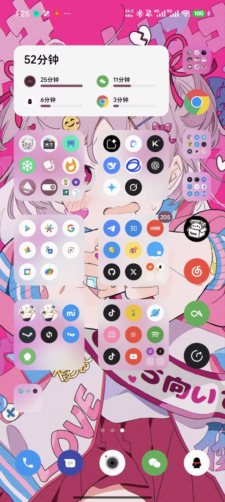
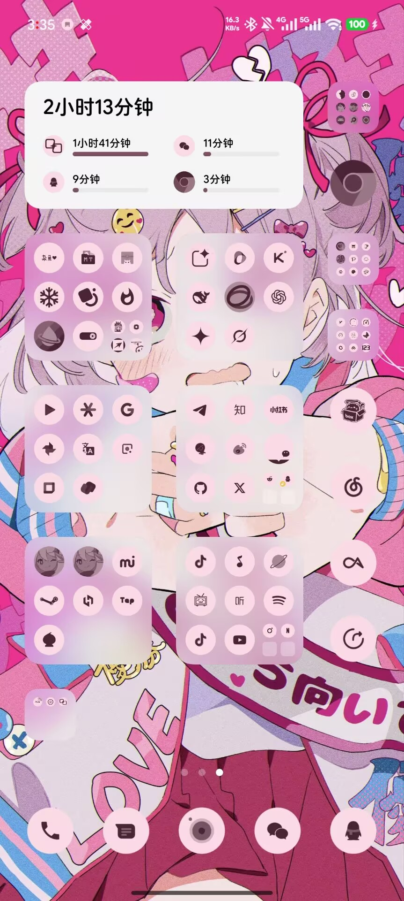
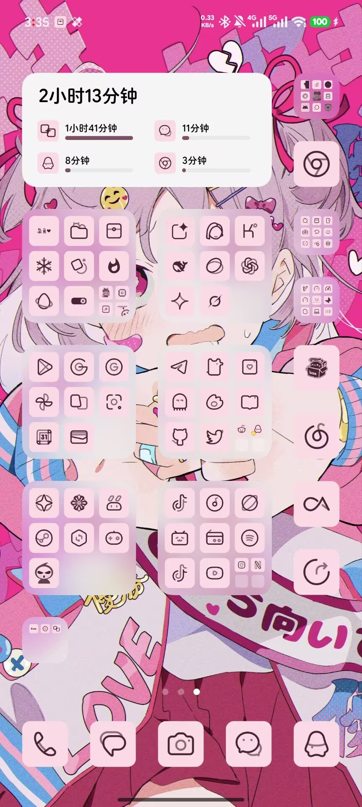

# Hyper Icon Pack

<p align="center">
  
</p>

<p align="center">
  将标准 Android 图标包转换为 Xiaomi HyperOS 可读取的系统主题图标资源。
</p>

<p align="center">
  <a href="https://github.com/yungui314/HyperIconPack/releases"></a>
  <a href="LICENSE"></a>
  
  
  
</p>

## 项目简介

Hyper Icon Pack 读取 Nova、ADW、Lawnchair 等通用图标包使用的 `appfilter.xml`，生成 HyperOS 私有 `icons` 主题归档，并通过 Root 安装到系统主题目录。所有应用图标最终都由 HyperOS 自己的 `ThemeResourcesSystem`、`IconCustomizer` 和系统主题资源链路读取。Xposed API 102 只承担 system_server DRM 保护，不 Hook Launcher、SystemUI 或 Framework 的图标和动画方法。

```text
appfilter.xml / 本机应用图标
        ↓
Hyper Icon Pack 转换器
        ↓
/data/system/theme/icons
        ↓
HyperOS 桌面、文件夹、设置与系统界面
```

主要能力：

- 转换标准 `appfilter.xml` 图标包，并为已安装应用生成包级资源。
- 对图标包未覆盖的应用套用其 `iconback`、`iconmask`、`iconupon` 与缩放规则。
- 可选全局 Monet 转换和自定义 Monet 配色。
- 转换结果保存为存档，之后切换同一存档无需重新生成。
- Root 原子安装、完整性校验、自动备份和一键恢复系统原图标。
- 新安装应用可增量补充进当前主题归档；卸载应用会从当前主题归档移除对应条目。
- 支持图标包明确声明的 HyperOS 动态日历资源；完整日历帧会复用静态图标的形状、alpha、原色/Monet 渲染，缺少动态资源时回退为静态图标。
- 所有普通图标统一使用保留 alpha 的主题主 PNG，并关闭不可靠的 LayerAdaptive 分层读取；圆形、圆角方形、直角方形和异形图标都由原图透明度决定形状，避免透明背景层被渲染成黑色方框。
- 动态时钟尚未形成可靠的通用转换方案；没有明确且完整的图标包预设时不会强行生成。

> [!IMPORTANT]
> `v0.9.40` 将完整转换、增量更新、缓存、动态日历和 PNG 渲染拆为独立模块，并修复并行转换时跨线程复用 `Drawable` 导致的图标形状异常。归档格式已升级为 30；升级后请重新转换图标包，不要继续应用旧格式存档。

## 效果展示

<table>
  <tr>
    <th>Pure Icon Pack · 原始配色</th>
    <th>Pure Icon Pack · Monet</th>
    <th>莫奈线条 · Monet</th>
  </tr>
  <tr>
    <td></td>
    <td></td>
    <td></td>
  </tr>
</table>

## 已测试环境

目前主要在以下设备上开发和验证：

| 项目 | 测试环境 |
| --- | --- |
| 设备 | Xiaomi 14 |
| 系统 | Xiaomi HyperOS `3.0.303.0` |
| 系统桌面 | `RELEASE-6.01.05.2407-06081949` |
| Root / Hook | Root + LSPosed |

> [!WARNING]
> 本项目最初为个人自用工具，目前没有在更多机型、HyperOS 版本或系统桌面版本上完成系统性测试，因此不保证其他环境可用。建议在操作前准备可恢复方案，并自行承担修改系统主题资源的风险。欢迎提交不同设备的测试反馈，也欢迎有能力的开发者贡献代码。

## 使用方法

1. 安装 APK，在支持 libxposed API 102 的框架中启用模块；静态作用域只保留 `system`（system_server）。
2. 桌面、设置、SystemUI、手机管家和小组件中心通过 HyperOS 系统主题资源读取图标，不向这些界面进程注入。
3. 打开“设置 > 制作图标包”，选择图标来源、适配比例和 Monet 设置。
4. 点击“转换并保存”，等待图标存档生成。
5. 在“图标存档”中选择刚生成的存档并应用。
6. 应用存档后，模块通过 Root 启动 APK 中的 `ThemeConfigurationCommand`，执行 HyperOS 主题商店同源的 `ThemeResourcesSystem.resetIcons()`、`IconCustomizer.clearCustomizedIcons(null)` 和 `themeChangedFlags=0x8` 刷新，再发送 `ACTION_THEME_CHANGED`。不再单独刷新小组件，也不杀死或重启 Launcher/SystemUI。

转换会覆盖完整 `appfilter.xml` 映射，并为当前系统已安装的第三方应用、系统应用、禁用应用、无桌面入口应用和 Activity Alias 生成必要的包级资源。未适配内容比例建议从 `85%` 开始，再按图标包风格调整。

## Xposed / libxposed API 102

- 模块要求支持 [libxposed API 102](https://libxposed.github.io/api/) 的 Xposed 框架。
- 静态作用域固定为 `system`（system_server），只防止 DRM 校验删除手装 `icons` 归档。桌面、SystemUI 和小组件完全走系统主题主 PNG 的原生链路。
- 模块配置通过 `RemotePreferences` 同步，不再使用旧版跨进程配置方案。
- `autoHotReload` 用于安装新版 APK 后热重载模块代码，不会重启桌面，也不会替代 HyperOS 官方图标配置刷新。
- 应用或切换图标存档后，模块会调用官方 `0x8` configuration 刷新；只有设备或主题管理器没有正确响应时，才需要按日志提示手动刷新。
- `v0.9.40` 将归档格式升级为 30。`v0.9.39` 及更早版本生成的存档需要重新转换；元数据校验会阻止直接应用不兼容的旧资源。

## 实现边界

- 本项目转换的是应用图标，不是包含字体、状态栏信号、电池、Framework 和 MAML 的完整主题商店主题。
- SystemUI 通知栏图标由系统自身规则处理；通知内容图片、Wi-Fi、信号、电池等资源不在 `appfilter.xml` 转换范围内。
- 动态日历资源会嵌入主 `icons` 归档的 `animating_icons` 路径，并关闭系统默认 `dynamicicons/layer_animating_icons` 覆盖，以保留图标包自己的形状和 Monet 效果。图标包若没有完整的动态日历预设，会回退为静态图标。
- 动态时钟目前只保留静态图标；图标包若没有经过验证的完整动态时钟预设，不会生成不可靠的系统原生方形时钟。
- Monet 转换需要从复杂位图中提取前景层级，渐变、半透明和极细线条图标仍可能与源图存在视觉差异。

## 反馈与贡献

提交问题时建议附上：

- 设备型号、HyperOS 完整版本和系统桌面版本；
- 图标包名称与版本；
- 是否开启 Monet、自定义配色及适配比例；
- 应用内“日志”页面中的应用日志和 Xposed 日志；
- 能复现问题的截图和操作步骤。

Issue、测试结果和 Pull Request 都欢迎。请尽量保持修改范围清晰，并说明真机验证环境。

## 许可证

本项目采用 [MIT License](LICENSE)。

## 感谢

- [Global Icon Pack](https://github.com/RichardLuo0/global-icon-pack-android)
- [Miuix](https://github.com/compose-miuix-ui/miuix)
- [Lawnchair](https://github.com/LawnchairLauncher/lawnchair)
- [Neo Launcher](https://github.com/NeoApplications/Neo-Launcher)
- [Kvaesitso](https://github.com/MM2-0/Kvaesitso)
- [Trebuchet](https://github.com/LineageOS/android_packages_apps_Trebuchet)

本项目部分方法和实现参考了以上开源项目。
